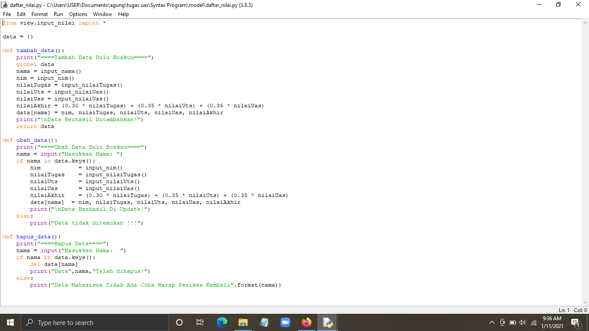
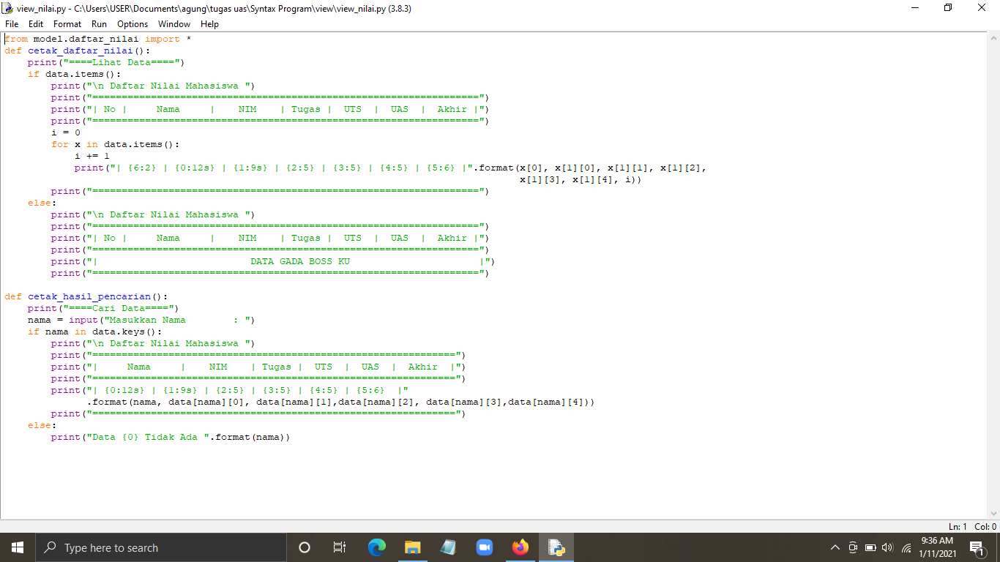
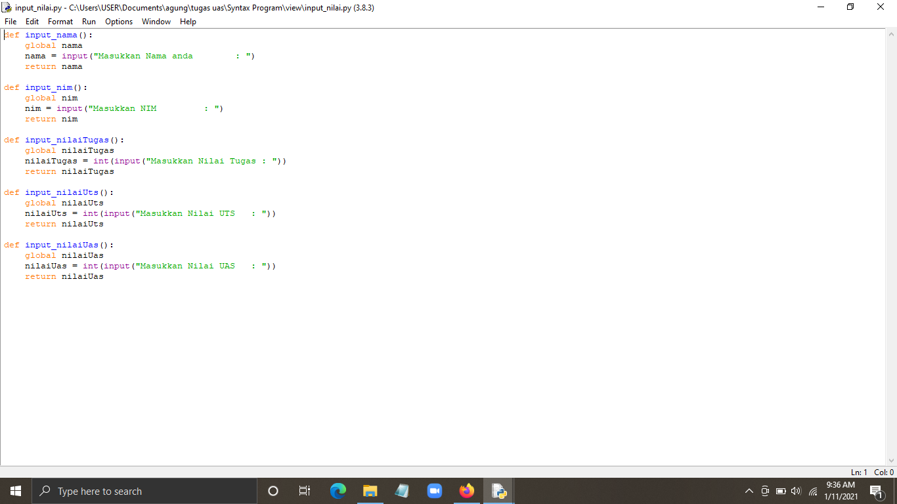
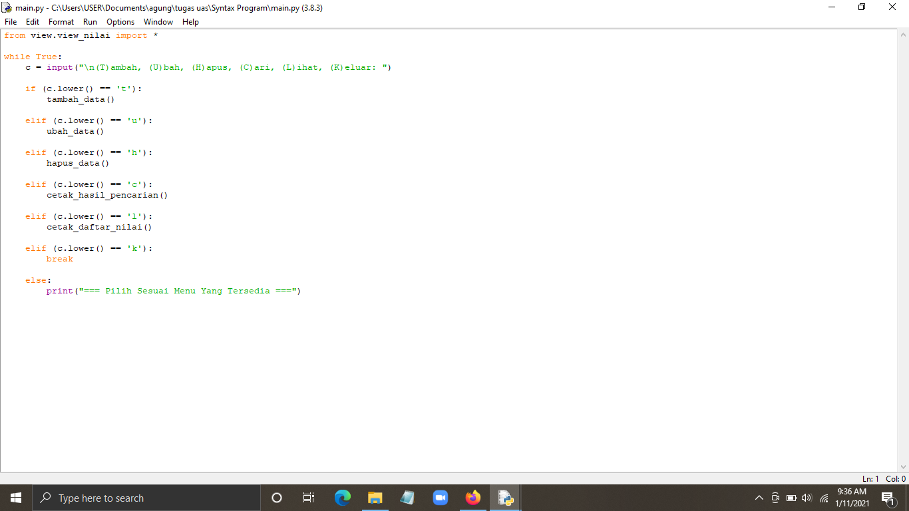
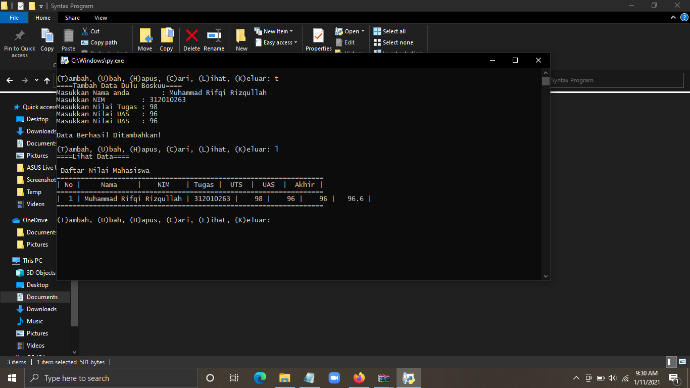

## Tugas Menyelesaikan UAS BAHASA PEMROGRAMAN
| Nama | kelas | Nim | Matkul |
| -- | --- | ---- | ----------- |
| Muhammad Rifqi Rizqullah | TI.A2.20 | 312010263  | Bahasa Pemrograman |
## Daftar Isi
| No | ISI | Link | Source Code |
| -- | --- | ---- | ----------- |
| 1. | Folder Syntax | [penjelasan](# Tugas PackageModule) | [codenye](main.py) |
| 2. | hasil Program | [penjelasan](# Tugas PackageModule) | [foto](image) |  

# Tugas PackageModule
Membuat package dan modul berdasarkan tugas praktikum yang sebelumnya dengan struktur seperti berikut:

- daftar_nilai.py berisi modul untuk: tambah_data, ubah_data, hapus_data, dan cari_data

- view_nilai.py berisi modul untuk: cetak_daftar_nilai, cetak_hasil_pencarian

- input_nilai.py berisi modul untuk: input_data yang meminta pengguna memasukkan data.

- main.py berisi program utama (menu pilihan yang memanggil semua menu yang ada

- hasil dari inputan program 

